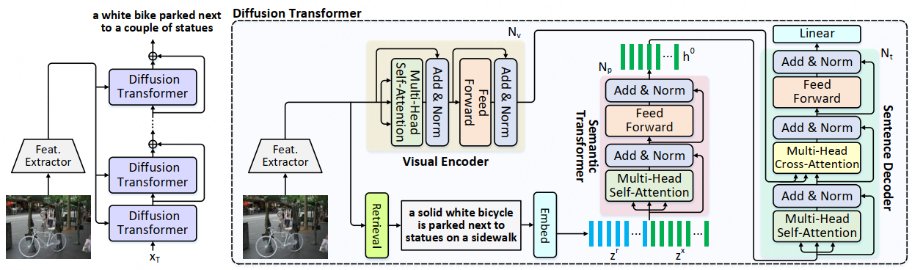

# Semantic-Conditional Diffusion Networks for Image Captioning

## Introduction
This repository is for *Semantic-Conditional Diffusion Networks for Image Captioning*. 

**For compatibility reasons, the reimplemented code and more detailed information are released in a official independent [repository]() currently. Code of SCD-Net will be merged into this official X-modaler repository in the future.**

<!-- ## Framework

 -->
